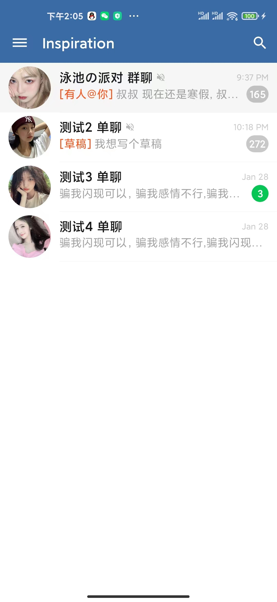

# 高仿 Telegram android 客户端UI
___

#### 适用范围
+ 可以用于学习研究
+ 产品二次改造，但不可相同包名

#### 界面列表

1. 会话界面
2. 聊天界面
3. 通讯录 -> 通讯录搜索
4. 群组 -> 创建群组
5. 个人设置界面
6. 登录相关界面

#### 技术说明

+ 完全kotlin语言
+ 基于MVVM开发
+ kapt
+ dagger.hilt 注入
+ 大量的livedata

#### 开发计划

+ Java 服务端已经完成 [done]
+ android chat 对接中 [doing]
+ ios 客户端开发（swift） [todo]
+ web 客户端开发（vue or react） [todo]
+ pc 客户端开发（c#）[todo]

#### 未来计划

1. 一个可以支持持续集成好玩东西的软件

	+ chatGPT
	+ ai绘画
	+ 支持定制专属机器人

2. 支持二次开发插口，实现自己的专属社群、嵌入特定页面，实现特定消息

3. 支持客户端独立oem

4. 支持服务端+客户端独立oem

## QQ群交流 590587904
## 微信交流 bjhjrj

# 截图展示

